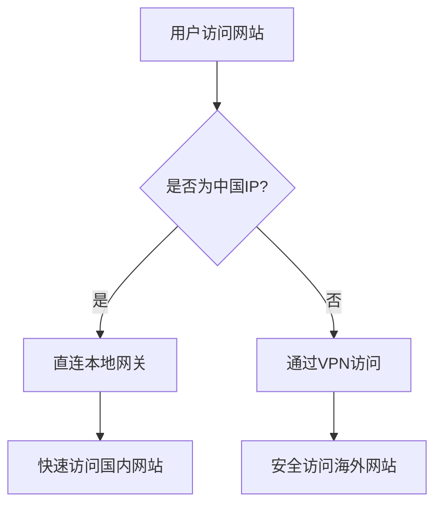

# Smart Route Manager

> 智能路由管理工具 - 为VPN用户优化中国网络访问

## 📖 简介

Smart Route Manager 是一个专为macOS设计的智能路由管理工具，解决使用VPN时访问中国网站速度慢的问题。

### 🎯 解决的问题

当你使用**三层(Layer 3) VPN**（如WireGuard、OpenVPN等）时，所有网络流量都会通过VPN服务器转发，包括访问中国网站的流量。这会导致：

- 🐌 **访问国内网站速度慢** - 国内流量绕道海外服务器
- 💸 **浪费VPN流量** - 本可直连的服务通过VPN转发
- ⏱️ **DNS解析延迟** - 国内DNS服务器通过VPN访问效率低

> **💡 为什么需要这个工具？**
> 
> - **三层VPN**（WireGuard、OpenVPN）工作在网络层，通常不提供智能分流功能
> - **七层VPN**（Clash、Shadowsocks等）工作在应用层，自带分流功能（黑白名单、规则路由等）
> 
> 如果你使用的是Clash等应用层代理工具，通常不需要本工具。

### ✨ 功能特性

- 🚀 **智能分流** - 中国IP地址和DNS服务器直连，其他流量走VPN
- 🔄 **自动适配** - WiFi切换时自动调整路由，无需手动操作
- 🛡️ **稳定可靠** - 系统服务模式，开机自启，异常自恢复
- ⚡ **高性能** - 8000+条路由规则，2秒内完成配置
- 📊 **实时监控** - 网络状态变化实时检测，3秒内响应

## 🔧 工作原理



Smart Route Manager 通过以下方式工作：

1. **监控网络状态** - 实时检测网关变化和VPN连接状态
2. **智能路由配置** - 为中国IP段设置直连路由规则
3. **自动维护** - WiFi切换时自动更新路由，保持最佳性能

## 🚀 安装

### 方法一：一键安装脚本（推荐）

#### macOS / Linux
```bash
# 直接从GitHub获取并执行安装脚本
curl -sSL https://raw.githubusercontent.com/wesleywu/smart-route/main/scripts/install.sh | bash

# 或者使用wget
wget -qO- https://raw.githubusercontent.com/wesleywu/smart-route/main/scripts/install.sh | bash
```

#### Windows (PowerShell)
```powershell
# 在PowerShell中执行（普通用户权限）
irm https://raw.githubusercontent.com/wesleywu/smart-route/main/scripts/install.ps1 | iex

# 如果需要同时安装系统服务，使用管理员权限运行
irm https://raw.githubusercontent.com/wesleywu/smart-route/main/scripts/install.ps1 | iex -Service
```

脚本会自动：
- ✅ 检测系统平台和架构
- ✅ 下载对应的预编译二进制文件
- ✅ 安装程序到 `~/.local/bin`
- ✅ 配置PATH环境变量
- ✅ 安装系统服务（可选）

> 💡 脚本会优先下载预编译的二进制文件，如果没有找到对应平台的版本，会自动回退到源码编译模式。

### 方法二：手动安装

```bash
# 1. 克隆项目
git clone https://github.com/wesleywu/smart-route.git
cd smart-route

# 2. 构建程序
go build -o smartroute ./cmd

# 3. 手动安装二进制文件和服务
sudo ./smartroute install
```

## 📋 使用指南

### 基本命令

```bash
# 查看版本和系统信息
smartroute version

# 测试配置和网络连接
smartroute test

# 一次性运行（设置路由后退出）
smartroute

# 以守护进程模式运行
smartroute daemon
```

### 服务管理

#### 查看服务状态
```bash
# 检查服务状态
sudo smartroute status

# 查看服务进程
sudo launchctl list | grep smartroute
```

#### 启动/停止服务
```bash
# 停止服务
sudo launchctl unload /Library/LaunchDaemons/com.smartroute.plist

# 启动服务
sudo launchctl load /Library/LaunchDaemons/com.smartroute.plist
```

#### 完全卸载
```bash
# 完全卸载（包括系统服务和二进制文件）
sudo smartroute uninstall

# 或者分步卸载
sudo launchctl unload /Library/LaunchDaemons/com.smartroute.plist  # 停止服务
sudo smartroute uninstall                                          # 完全清理
```

### 查看日志

```bash
# 查看服务输出日志
tail -f /var/log/smartroute.out.log

# 查看错误日志
tail -f /var/log/smartroute.err.log

# 查看最近50行日志
tail -50 /var/log/smartroute.out.log
```

### 常见使用场景

#### 场景1：首次使用
```bash
# 1. 连接你的VPN（如WireGuard）
# 2. 一键安装（自动安装系统服务）
curl -sSL https://raw.githubusercontent.com/wesleywu/smart-route/main/scripts/install.sh | bash

# 3. 检查服务状态
sudo smartroute status
```

#### 场景2：WiFi切换
服务模式下，WiFi切换会自动处理：
```bash
# 查看实时日志，观察自动切换过程
tail -f /var/log/smartroute.out.log
```

#### 场景3：故障排查
```bash
# 检查服务状态
sudo smartroute status

# 检查最近的错误
tail -20 /var/log/smartroute.err.log

# 重启服务
sudo launchctl unload /Library/LaunchDaemons/com.smartroute.plist
sudo launchctl load /Library/LaunchDaemons/com.smartroute.plist
```

## 📊 日志说明

### 正常运行日志示例
```json
{"time":"2025-08-27T20:31:19.881299+08:00","level":"INFO","msg":"Service starting","component":"service","version":"1.0.0","pid":"320"}
{"time":"2025-08-27T20:31:19.88156+08:00","level":"INFO","msg":"Configuration loaded","component":"service","chn_routes":8690,"chn_dns":4}
{"time":"2025-08-27T20:31:19.885712+08:00","level":"INFO","msg":"VPN detected - setting up routes","component":"service","vpn_interface":"utun6","physical_gateway":"192.168.32.1"}
{"time":"2025-08-27T20:31:21.93322+08:00","level":"INFO","msg":"Smart routing configured","component":"service","gateway":"192.168.32.1"}
{"time":"2025-08-27T20:31:21.933302+08:00","level":"INFO","msg":"Network monitor started","component":"service","poll_interval":"2s"}
```

### WiFi切换日志示例
```json
{"time":"2025-08-27T20:30:15.371063+08:00","level":"INFO","msg":"Gateway changed","component":"service","new_gateway":"192.168.32.1","vpn_interface":"utun6","vpn_status":"on"}
{"time":"2025-08-27T20:30:17.209875+08:00","level":"INFO","msg":"Smart routing configured","component":"service","gateway":"192.168.32.1"}
```

### 日志字段说明
- `Service starting` - 服务启动
- `Configuration loaded` - 配置加载完成，显示路由数量
- `VPN detected` - 检测到VPN连接
- `Smart routing configured` - 智能路由配置完成
- `Gateway changed` - 网关变化（WiFi切换）
- `vpn_status` - VPN状态（on/off）

## ❓ 常见问题

### Q: 为什么需要sudo权限？
A: 修改系统路由表需要管理员权限，这是macOS的安全机制。

### Q: 会不会影响VPN的安全性？
A: 不会。只有中国IP地址直连，其他流量仍然通过VPN加密传输。

### Q: WiFi切换后需要手动操作吗？
A: 不需要。服务模式下会自动检测网关变化并调整路由。

### Q: 如何确认路由配置生效？
A: 访问国内网站（如 `baidu.com`）应该明显加速，可以通过 `traceroute` 命令验证路径。

### Q: 服务占用多少资源？
A: 正常运行时内存占用约10-20MB，CPU占用< 1%。

## 🛠️ 技术规格

- **支持系统**: macOS 10.15+
- **网络协议**: IPv4路由表操作
- **兼容VPN**: WireGuard、Clash、其他VPN软件
- **路由规则**: 8690个中国IP网段 + 4个DNS服务器
- **性能**: 2秒内完成路由配置
- **监控延迟**: < 3秒检测网络变化

## 📄 许可证

本项目采用 MIT 许可证。详见 [LICENSE](LICENSE) 文件。

---

🌟 如果这个工具帮助到了你，请给个 Star 支持一下！